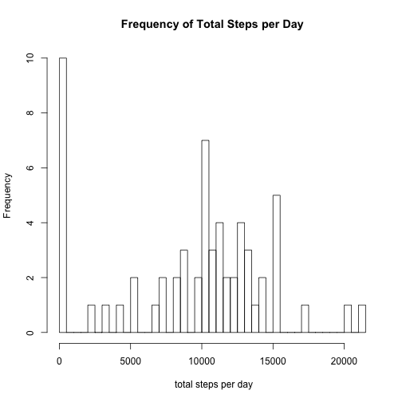
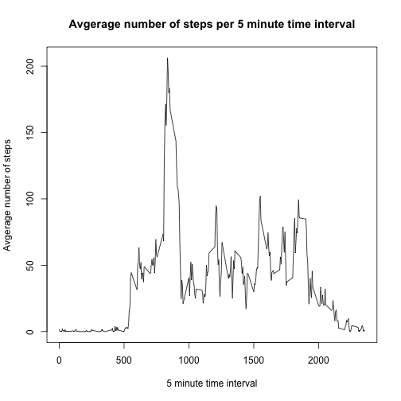
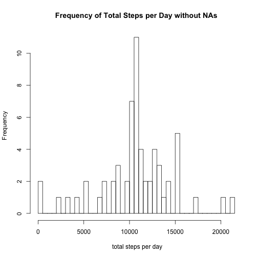
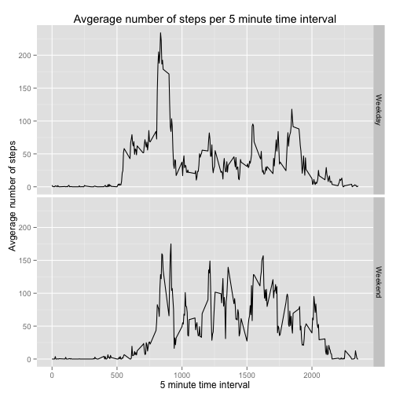

##Loading and Processing Data
- Code first checks if the activity data is in the working directory
- If not there then the data is downloaded and unzipped
- The unzipped csv file is then read using read.csv

```r
if(!file.exists("./activity.csv")){
        fileUrl <- "http://d396qusza40orc.cloudfront.net/repdata%2Fdata%2Factivity.zip" 
        download.file(fileUrl, "repdata%2Fdata%2Factivity.zip") 
        unzip("repdata%2Fdata%2Factivity.zip")
}
activity_data <- read.csv("activity.csv")
```

##What is mean total number of steps taken per day?
### histogram of the total number of steps taken each day
- data.table package was used to aggregate the total steps per day by date
- Frequency of total steps per day in aggregated data was visualized as histogram

```r
library("data.table")
activity_data_dt <- data.table(activity_data)
setkey(activity_data_dt, date)
steps_per_day <- activity_data_dt[, list(totalstepsperday=sum(steps, na.rm=T)), 
                                  list(date=date)]
hist(steps_per_day$totalstepsperday, breaks=50, 
     main="Frequency of Total Steps per Day", xlab=" total steps per day")
```

 

### Mean and median total number of steps taken per day
- Mean and median was calculated in summary of steps_per_day data table

```r
summary(steps_per_day)
```

```
##          date    totalstepsperday
##  2012-10-01: 1   Min.   :    0   
##  2012-10-02: 1   1st Qu.: 6778   
##  2012-10-03: 1   Median :10395   
##  2012-10-04: 1   Mean   : 9354   
##  2012-10-05: 1   3rd Qu.:12811   
##  2012-10-06: 1   Max.   :21194   
##  (Other)   :55
```

- The mean and median total steps per day was 9354 and 10395 steps respectively

##What is the average daily activity pattern?
###Avgerage number of steps per 5 minute interval
- data.table package is used to aggragate the average number of steps per 5 minute time interval
- Plot function was used to visualize these averages of the step number over the different time intervals

```r
setkey(activity_data_dt, interval)
avg_steps_interval <- activity_data_dt[, list(avgstepsperinterval=mean(steps, na.rm=T)), 
                                  list(interval=interval)]
plot(avg_steps_interval$interval, avg_steps_interval$avgstepsperinterval, 
     type="l", main="Avgerage number of steps per 5 minute time interval", 
     xlab="5 minute time interval", ylab="Avgerage number of steps")
```

 


###5 minute interval with the maximum number of steps
- The data table was subsetted using which.max function to display the the time interval with the max number of steps and the value for this max

```r
avg_steps_interval[which.max(avg_steps_interval$avgstepsperinterval),]
```

```
##    interval avgstepsperinterval
## 1:      835               206.2
```

- The 835 time interval had the maximum average setps at 206.2 steps

##Imputing missing values
###total number of missing values in the dataset
- The number of missing values in data set was calculate by combining the sum and is.na functions

```r
sum(is.na(activity_data_dt))
```

```
## [1] 2304
```

- There are 2304 missing values in this data set
  
###Strategy for filling in all of the missing values in the dataset
- Filling in the missing values with the average values for each interval seems like the best strategy
- To accomplish this we first need some information about the values that will relpace the missing values and where these missing values are in the data frame:
   1) First determine the length of the the vector containing the replacement values (average steps for each time interval)
   2) Then create a table that displays the number of missing values for each day in the data frame


```r
length(avg_steps_interval$avgstepsperinterval)
```

```
## [1] 288
```

```r
na.activity_data <- activity_data[is.na(activity_data),]
table(na.activity_data$date)
```

```
## 
## 2012-10-01 2012-10-02 2012-10-03 2012-10-04 2012-10-05 2012-10-06 
##        288          0          0          0          0          0 
## 2012-10-07 2012-10-08 2012-10-09 2012-10-10 2012-10-11 2012-10-12 
##          0        288          0          0          0          0 
## 2012-10-13 2012-10-14 2012-10-15 2012-10-16 2012-10-17 2012-10-18 
##          0          0          0          0          0          0 
## 2012-10-19 2012-10-20 2012-10-21 2012-10-22 2012-10-23 2012-10-24 
##          0          0          0          0          0          0 
## 2012-10-25 2012-10-26 2012-10-27 2012-10-28 2012-10-29 2012-10-30 
##          0          0          0          0          0          0 
## 2012-10-31 2012-11-01 2012-11-02 2012-11-03 2012-11-04 2012-11-05 
##          0        288          0          0        288          0 
## 2012-11-06 2012-11-07 2012-11-08 2012-11-09 2012-11-10 2012-11-11 
##          0          0          0        288        288          0 
## 2012-11-12 2012-11-13 2012-11-14 2012-11-15 2012-11-16 2012-11-17 
##          0          0        288          0          0          0 
## 2012-11-18 2012-11-19 2012-11-20 2012-11-21 2012-11-22 2012-11-23 
##          0          0          0          0          0          0 
## 2012-11-24 2012-11-25 2012-11-26 2012-11-27 2012-11-28 2012-11-29 
##          0          0          0          0          0          0 
## 2012-11-30 
##        288
```

- Since the length of the vector containing the average steps for each time interval is the same as the number of missing values for all of the dates that contain missing values we can conclude:
    1) All the mising values in this data frame are in the step column 
    1) Days with missing values have missing values for all time intervals on that date
    2) Missing values for these dates can easily be replaced using a vector containing the average steps for each interval

###Create a new dataset that is equal to the original dataset but with the missing data filled in
- A new data frame is first created where the missing values will be replaced
- The replacement is done by first checking if the value is missing and then replacing with the corresponding average steps taken for that particular time interval
- The replacement of missing values in this data frame is checked by creating a table that displays the number of missing values for each day in the data frame

```r
na_replace_data <- activity_data
na_replace_data$steps[is.na(na_replace_data$steps) == TRUE] <- avg_steps_interval$avgstepsperinterval
na.na_replace_data <- na_replace_data[is.na(na_replace_data),]
table(na.na_replace_data$date)
```

```
## 
## 2012-10-01 2012-10-02 2012-10-03 2012-10-04 2012-10-05 2012-10-06 
##          0          0          0          0          0          0 
## 2012-10-07 2012-10-08 2012-10-09 2012-10-10 2012-10-11 2012-10-12 
##          0          0          0          0          0          0 
## 2012-10-13 2012-10-14 2012-10-15 2012-10-16 2012-10-17 2012-10-18 
##          0          0          0          0          0          0 
## 2012-10-19 2012-10-20 2012-10-21 2012-10-22 2012-10-23 2012-10-24 
##          0          0          0          0          0          0 
## 2012-10-25 2012-10-26 2012-10-27 2012-10-28 2012-10-29 2012-10-30 
##          0          0          0          0          0          0 
## 2012-10-31 2012-11-01 2012-11-02 2012-11-03 2012-11-04 2012-11-05 
##          0          0          0          0          0          0 
## 2012-11-06 2012-11-07 2012-11-08 2012-11-09 2012-11-10 2012-11-11 
##          0          0          0          0          0          0 
## 2012-11-12 2012-11-13 2012-11-14 2012-11-15 2012-11-16 2012-11-17 
##          0          0          0          0          0          0 
## 2012-11-18 2012-11-19 2012-11-20 2012-11-21 2012-11-22 2012-11-23 
##          0          0          0          0          0          0 
## 2012-11-24 2012-11-25 2012-11-26 2012-11-27 2012-11-28 2012-11-29 
##          0          0          0          0          0          0 
## 2012-11-30 
##          0
```

- All missing values were replaced

###Make a histogram of the total number of steps taken each day
- With the data frame where NAs were replaced, the data.table package was used to aggregate the total number of steps per day
- Frequency of total steps per day in this aggregated data was visualized as a histogram 

```r
library("data.table")
na_replace_data_dt <- data.table(na_replace_data)
setkey(na_replace_data_dt, date)
steps_per_day_no_na <- na_replace_data_dt[, 
                                    list(totalstepsperday=sum(steps)),
                                    list(date=date)]
hist(steps_per_day_no_na$totalstepsperday, breaks=50, 
     main="Frequency of Total Steps per Day without NAs", xlab=" total steps per day")
```

 

- With the NAs replaced this histogram shows an 80% reduction in the frequency of the bin with the lowest number of steps
- There is a corresponding increase in the frequency of a bin near the median making this look like a more normal distribution

###Calculate and report the mean and median total number of steps taken per day.

```r
summary(steps_per_day_no_na)
```

```
##          date    totalstepsperday
##  2012-10-01: 1   Min.   :   41   
##  2012-10-02: 1   1st Qu.: 9819   
##  2012-10-03: 1   Median :10766   
##  2012-10-04: 1   Mean   :10766   
##  2012-10-05: 1   3rd Qu.:12811   
##  2012-10-06: 1   Max.   :21194   
##  (Other)   :55
```

- With the NAs replaced both median and mean value for total number of steps per day increases to 10766 steps

##Are there differences in activity patterns between weekdays and weekends?
###Create a new factor variable in the dataset with two levels – “weekday” and “weekend” indicating whether a given date is a weekday or weekend day
- To make the weekday/weekend factor variable a new column was added to the data frame in which the values from the date column were converted to POSIX class
- The ifelse function was then used to convert the dates to either "weekday" or "weekend" based on the results of the weekdays function

```r
activity_data$weekdayorweekend <- as.POSIXct(strptime(activity_data$date, 
                                                      "%Y-%m-%d"))
activity_data$weekdayorweekend <- ifelse(weekdays(activity_data$weekdayorweekend)
                                         == "Sunday" 
                                         | weekdays(activity_data$weekdayorweekend)
                                         == "Saturday", "Weekend", "Weekday")
```

###Make a panel plot containing a time series plot of the 5-minute interval and the average number of steps taken, averaged across all weekday days or weekend days.
- The data.table package was used to aggregate the average number of steps by time interval and the weekday/weekend variable
- The resuls of this aggregated table were then plotted as a line graph using qplot with the interval on the x-axis, average number of steps on the y-axis and faceted using the weekday/weekend variable

```r
library("data.table")
activity_data_dt <- data.table(activity_data)
setkey(activity_data_dt, interval, weekdayorweekend)
avg_steps_interval <- activity_data_dt[, list(avgstepsperinterval=mean(steps, na.rm=T)),
                                       list(interval=interval, 
                                       weekdayorweekend= weekdayorweekend)]
library("ggplot2")
qplot(x = interval, y = avgstepsperinterval, data = avg_steps_interval, 
      facets = weekdayorweekend~., geom = "line",
      main="Avgerage number of steps per 5 minute time interval",
      xlab="5 minute time interval", ylab="Avgerage number of steps")
```

 

- The plots show obvious differences in the activity patterns from weekday to weekend
- The weekdays show a spike in activity during the morning hours while the activity is maintained at a much lower level through the rest of the day
-  The weekends, in contrast, do not display a similar morning spike in activity but instead maintain a higher level of activity throughout the entire day
